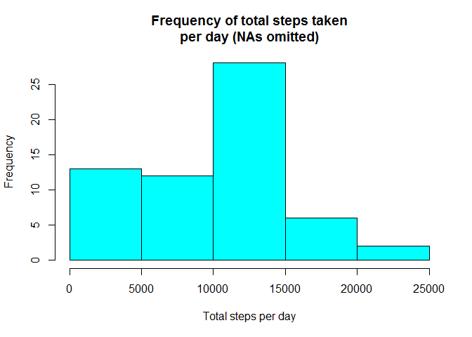
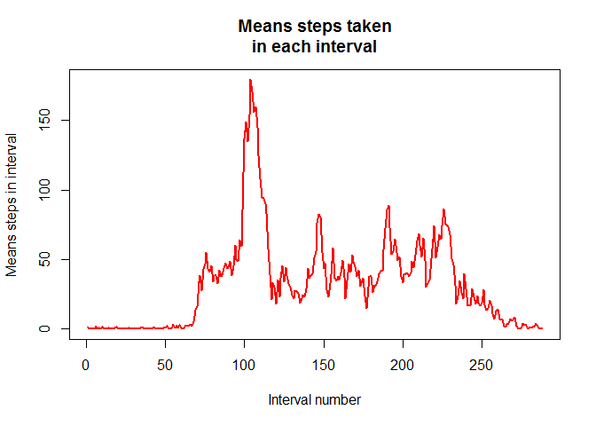
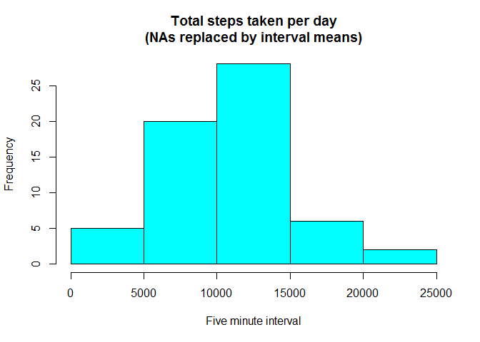
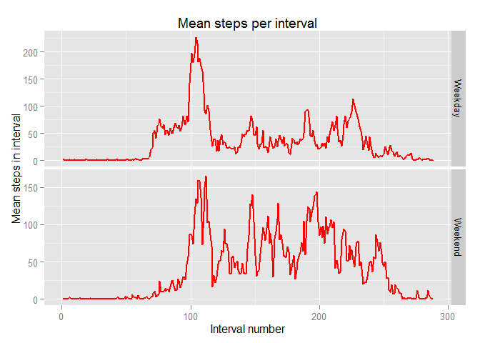

# Reproducible Research: Peer Assessment 1
## Loading and preprocessing the data

First we load the raw data into the data frame "activity."


```r
activity  <- read.csv("D:/Coursera courses/Data Science Specialization/Reproducible Research/PA1_template (credit registration GitHub submission)/activity.csv")
```

## What is the mean total number of steps taken per day?


We accumulate the number of steps for each day, omitting records with NAs, 
and display the results in a histogram.  Then we determine the mean and median 
number of these total steps; we find that the mean is 9354.23 and the median is 10395.  Below, we will
compare these values to those we find for the data set with NAs replaced by imputed values.


```r
## First determine total steps for each day with NAs omitted:

total.steps.per.day  <- aggregate(activity$steps, by=list(activity$date), FUN = sum, na.rm = T)

names(total.steps.per.day) <- c("date", "total.steps")

## Display these totals in a histogram:

hist(total.steps.per.day$total.steps, main = "Frequency of total steps taken\nper day (NAs omitted)", xlab = "Total steps per day", col = "cyan")
```

 

```r
## Determine the mean and median of these totals with NAs omitted:

mean.steps.per.day <- mean(total.steps.per.day$total.steps); mean.steps.per.day
```

```
## [1] 9354.23
```

```r
median.steps.per.day <- median(total.steps.per.day$total.steps);  median.steps.per.day
```

```
## [1] 10395
```


## What is the average daily activity pattern?

Now we determine the average number of steps in each five minute interval with NAs 
omitted and display these results in a time series plot.  We find that the maximal mean 
number of steps taken in any interval is 179.1311; this occurs in the time interval 8:35-8:39 am.


```r
## Determine the average numbers of steps in each five minute interval with NAs omitted:

total.steps.per.interval  <- aggregate(activity$steps, by=list(activity$interval), 
FUN = sum, na.rm = T)

names(total.steps.per.interval) <- c("interval", "total.steps")

mean.steps.per.interval <- total.steps.per.interval$total.steps / length(unique
(activity$date))

## Make a line plot of these interval means:

plot(1:(24 * 60 / 5), mean.steps.per.interval, type = "l", col = "red", xlab = 
"Interval number", 
     ylab = "Means steps in interval", main = "Means steps taken\nin each interval", lwd=2)
```

 

```r
## Determine which interval has the maximum mean steps.

order  <- order(mean.steps.per.interval, decreasing = T); order[1]
```

```
## [1] 104
```

```r
## This is 8:35-8:39 am.  What is this maximum value?:

max.mean.steps.per.interval <- mean.steps.per.interval[order[1]];  max.mean.steps.per.interval
```

```
## [1] 179.1311
```


## Imputing missing values

We repeat the calculation of total steps per day, generate a histogram of 
these totals and determine the mean and median for these data with imputed values replacing the NAs 
in the original data set.  There are 2304 records with NAs: for each of these we use modular arithmetic 
to replace the NA value by the mean number of steps taken in the time interval represented.

There were days with all observations recorded as zero by the aggregate function due to NAs: these days now have nonzero observations due to the imputed values we have constructed.  This means that the mean number of steps per day has to increase from the value of 
9354.23 that we found when excluding NAs, and in fact, with these imputed values replacing the NA values, we find that the mean number of steps per day has indeed increased to 10581.01.  On the other hand, the median is 10395, the same value we found when excluding NAs.


```r
## Determine how many rows contain NAs for the number of steps:

number.rows.with.NA  <- sum(is.na(activity$steps)); number.rows.with.NA
```

```
## [1] 2304
```

```r
## Use modular arithemetic to replace each NA with the mean number of steps in the time interval it represents:

for (i in 1:length(activity$interval))
{
  if(is.na(activity$steps[i])) 
  {activity$steps[i] <- mean.steps.per.interval[(i-1)%%288 + 1]}    
}

## Now the activity dataframe contains no NAS

total.steps.per.day  <- aggregate(activity$steps, by=list(activity$date), FUN = sum)

names(total.steps.per.day) <- c("date", "total.steps")

## Repeat the histogram:

hist(total.steps.per.day$total.steps, main = "Total steps taken per day\n(NAs replaced by interval means)", xlab = "Five minute interval", col = "cyan")
```

 

```r
## Repeat the calculation of the mean and median:

mean.steps.per.day <- mean(total.steps.per.day$total.steps); mean.steps.per.day
```

```
## [1] 10581.01
```

```r
median.steps.per.day <- median(total.steps.per.day$total.steps); 
median.steps.per.day
```

```
## [1] 10395
```

```r
## Note that, as predicted, the mean is slightly larger than the previous value but the median is the same as before removal of NAs.
```


## Are there differences in activity patterns between weekdays and weekends?

Finally we distinguish week days from weekends using the weekdays() function.  Then 
we count the number of week days and weekend days, determine the mean number of steps in each time 
interval in each case, and graph the results in a two panel graph that allows easy comparison between the 
two periods.  As expected, we find that activity extends more broadly throughout the day on weekends than is true on week days.


```r
## Distinguish weekdays and weekends:

activity$day.type  <- "Weekday"

activity$day.type[weekdays(as.Date(activity$date)) == "Saturday"]  <- "Weekend"

activity$day.type[weekdays(as.Date(activity$date)) == "Sunday"]  <- "Weekend"

## Determine how many weekdays and how many weekend days:

no.weekdays <- sum(activity$day.type=="Weekday")/288; no.weekdays
```

```
## [1] 45
```

```r
no.weekenddays <- sum(activity$day.type=="Weekend")/288; no.weekenddays
```

```
## [1] 16
```

```r
## Break out the total number of steps by combination of interval and day type (weekday or weekend):

total.steps.per.interval <- aggregate(activity$steps, by=list(activity$interval, activity$day.type), FUN = sum)

names(total.steps.per.interval) <- c("interval", "day.type", "total.steps")

## Determine the means for each interval:

for (i in 1:576)
{
  if (total.steps.per.interval$day.type[i]=="Weekday") 
  {
    total.steps.per.interval$mean.steps[i] <- total.steps.per.interval$total.steps[i]/no.weekdays
  }
  else
  {
    total.steps.per.interval$mean.steps[i] <- total.steps.per.interval$total.steps[i]/no.weekenddays
  }
}

## Write in the x axis value for the plot:

total.steps.per.interval$x <- c(1:288, 1:288)

library(ggplot2)
```

```
## Warning: package 'ggplot2' was built under R version 3.1.3
```

```r
ggplot(total.steps.per.interval, aes(x = x, y = mean.steps)) +
  geom_line(col="red", lwd = 1) + facet_grid(day.type ~ ., scales = "free") + 
  labs(title = "Mean steps per interval", x = "Interval number", y = "Mean steps in interval")
```

 
